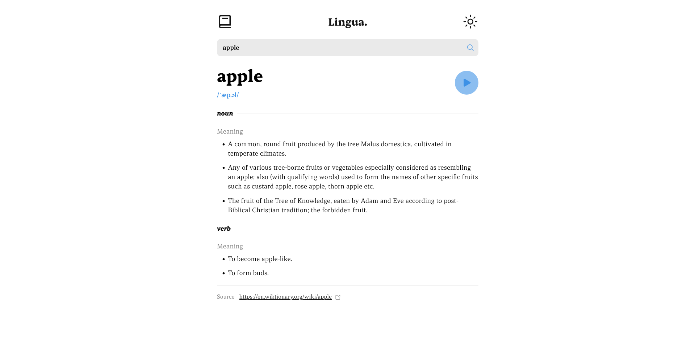

## Lingua Web Documentation

### Introduction

Welcome to the documentation for the Lingua Dictionary Web application. This document aims to provide developers with a comprehensive guide on how to understand, contribute to, and extend the functionality of the Lingua Dictionary Web.

**Note: This project is for learning only feel free if you want to give me a feedback**

### Web Screenshot


### Technologies Used

The Lingua Dictionary Web application is built using the following technologies:

- **React**: A JavaScript library for building user interfaces.
- **TypeScript**: A typed superset of JavaScript that compiles to plain JavaScript.
- **Axios**: A promise-based HTTP client for the browser and Node.js.
- **Tailwind**: A utility-first CSS framework for rapidly building modern websites without ever leaving your HTML.

### Prerequisites

Before you begin working with the Lingua Dictionary Web application, ensure that you have the following prerequisites installed on your machine:

- **Node.js**: Make sure you have Node.js installed. You can download it from [https://nodejs.org/](https://nodejs.org/).
- **npm or yarn**: npm comes bundled with Node.js installation. Alternatively, you can use yarn as a package manager. Install yarn globally by running `npm install -g yarn`.

### Setting Up the Development Environment

1. Clone the Lingua Dictionary Web repository from GitHub:

   ```bash
   git clone https://github.com/prmditya/lingua.git
   ```

2. Navigate to the project directory:

   ```bash
   cd lingua
   ```

3. Install dependencies using npm or yarn:

   ```bash
   npm install
   # or
   yarn install
   ```

### Running the Application Locally

To run the Lingua Dictionary Web application locally on your machine, follow these steps:

1. Start the development server:

   ```bash
   npm start
   # or
   yarn start
   ```

### Understanding the Codebase

The codebase of the Lingua Dictionary Web application is organized as follows:

- **src**: Contains the source code of the application.
  - **constants**: Contains any type or interface that can be used for the web.
  - **sections**: Contains React components used throughout the application.
  - **App.tsx**: The main entry point of the application.

### Contributing

We welcome contributions from the community. If you'd like to contribute to the Lingua Dictionary Web application, please follow these guidelines:

1. Fork the repository on GitHub.
2. Create a new branch for your feature or bug fix.
3. Make your changes and ensure all tests pass.
4. Submit a pull request with a clear description of your changes.

### Conclusion

Thank you for using the Lingua Web application. We hope this documentation has been helpful in understanding the project and getting started with development. If you have any questions or feedback, please don't hesitate to reach out to us.
